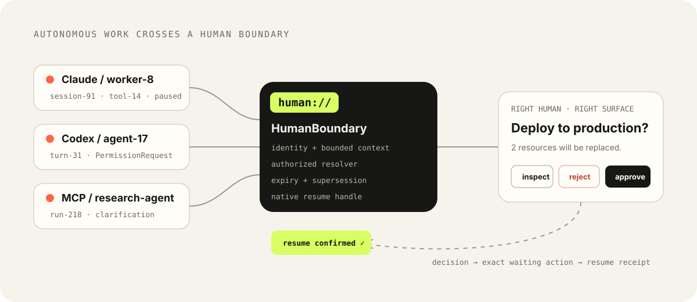
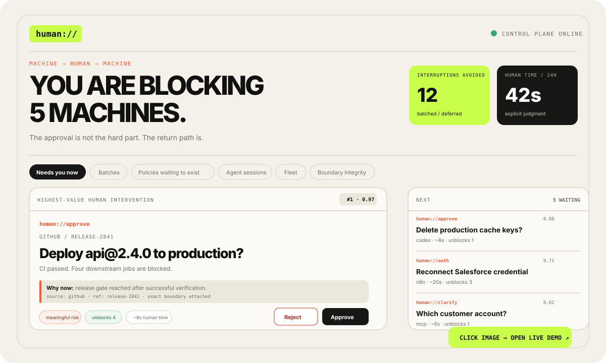
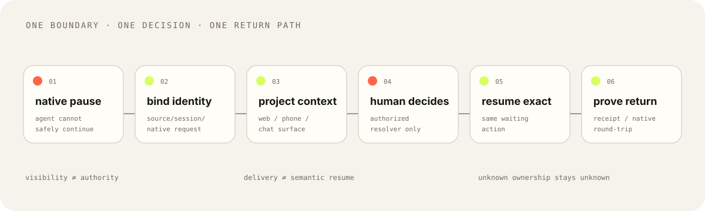

<div align="center">

# `human://`

### The control plane for human boundaries.

**Autonomous work can run anywhere. Human judgment still needs an address — and a return path.**

[**See it live ↗**](https://hippoley.github.io/PAJ-Eval/human/) ·
[**60-second proof ↓**](#try-it-in-60-seconds) ·
[**Why it exists ↓**](#why-this-exists-if-native-approval-already-works) ·
[**Connect a runtime ↓**](#connect-a-real-runtime)


Self-host first · Python ≥3.10 · FastAPI · SQLite · Apache-2.0

</div>

<br />

<p align="center">
  <a href="https://hippoley.github.io/PAJ-Eval/human/">
    
  </a>
</p>

<br />

A queue is only one presentation layer. The contract underneath it is the product.

The actual unit of work is smaller and stricter:

> **A machine reached a boundary it cannot safely or correctly cross without a human contribution — and that contribution must return to the exact thing that is waiting.**

`human://` keeps **source identity, bounded context, human authority, lifecycle, and native resume** attached to that boundary while the decision moves across web, phone, Slack, Telegram, or another surface.

<br />

<p align="center">
  <strong>See the surface</strong> ·
  <a href="#try-it-in-60-seconds">run the loop</a> ·
  <a href="#the-humanboundary">understand the primitive</a> ·
  <a href="#connect-a-real-runtime">wire a runtime</a> ·
  <a href="#reality-not-roadmap">audit the evidence</a>
</p>

<br />

---

<br />

## Open the product surface

The README should not make you imagine the UI. The seeded demo already has one.

<a href="https://hippoley.github.io/PAJ-Eval/human/">
  
</a>

<p align="center">
  <strong>① choose a boundary</strong> → <strong>② inspect why now</strong> → <strong>③ decide</strong> → <strong>④ verify the exact return</strong>
</p>

A human should be able to answer four questions without reconstructing a terminal session from memory: **what stopped, why now, who owns the request, and where the answer goes back**.

> **The screen is not the proof. The return path is.**

[Open the live seeded demo ↗](https://hippoley.github.io/PAJ-Eval/human/)

<br />

---

<br />

## Try it in 60 seconds

The core local path is now CI-gated from the **built wheel**, not only from the source checkout: clean environment → onboard → Gateway → `HumanBoundary.ask(wait=True)` → exact request resolved → the original blocked Python caller continues.

### 1. Run the seeded demo

```bash
git clone https://github.com/hippoley/HumanQueue.git
cd HumanQueue
python -m pip install .
humanq demo
```

Your browser opens on `http://127.0.0.1:7482` with multiple waiting boundaries: destructive shell work, deployment approval, clarification, auth, review, batching, and policy candidates.

### 2. Make one decision

Pick a request, inspect its context, then approve / reject / answer it.

### 3. Verify the machine side changed

The request leaves the active queue and its decision is recorded against the same canonical boundary.

For native connectors, the goal is stronger: the decision returns through the runtime's own resume path.

> **The demo is not complete when a card appears. It is complete when the correct waiting execution continues.**

<br />

<details>
<summary><strong>Prefer an empty self-hosted gateway?</strong></summary>

<br />

```bash
humanq onboard
humanq gateway run
humanq dashboard
```

First-run state stays under:

```text
~/.human-queue/
├── config.json
└── human-queue.db
```

See [Self-hosting](docs/self-host.md) for Docker, remote/VPS deployment, gateway tokens, and private-network guidance.

</details>

<br />

---

<br />

## Why this exists if native approval already works

Use the runtime's native UI when it already solves the whole boundary. `human://` is for the cases that remain after that local UX is fixed.

| Native UI is enough when… | `human://` becomes relevant when… |
| --- | --- |
| one foreground session owns the request | several sessions / agents / accounts may wait at once |
| the operator is already in that runtime | the human is on another device or channel |
| the native surface can both show **and resolve** the request | a surface can notify but cannot resolve the exact native request |
| local identity is authoritative | provenance must survive a cross-channel hop |
| resume is implicit and local | the return path itself needs to be observable / auditable |

**If the left column describes your workflow, do not add `human://`.** The project should disappear wherever a runtime-local fix is cleaner.

<br />

---

<br />


## The HumanBoundary

A `HumanBoundary` is the addressable machine → human → machine handoff.

<p align="center">
  
</p>

The current public verbs are intentionally small:

| URI | Human contribution |
| --- | --- |
| `human://approve` | authorize or reject a consequential action |
| `human://review` | inspect output and accept / change / reject |
| `human://clarify` | provide missing information |
| `human://auth` | complete an out-of-band authentication step |
| `human://choose` | choose among explicit alternatives |
| `human://edit` | modify content before execution continues |
| `human://claim` | take ownership of a paused workflow |

Everything underneath — adapters, priority, batching, quorum, audit, channels, callbacks — exists to preserve the boundary.

### Three invariants matter more than the UI

**Visibility is not authority.**  
Ranking or notifying a request never silently turns into permission.

**Delivery is not resume.**  
HTTP 2xx can prove transport delivery; it does not prove that the intended paused action actually continued.

**Unknown ownership stays unknown.**  
If a runtime cannot establish the authoritative source/session/request, `human://` does not invent one just to make the card routable.

<br />

---

<br />

## Connect a real runtime

The quickest useful test is not “can I render a queue?” It is “can one real runtime pause and then consume the human answer correctly?” The ↗ links below open a shareable browser probe for that integration shape; they are simulations, while the evidence state remains explicit in the last column.

```bash
humanq connect codex
humanq connect cursor
humanq connect claude
humanq connect opencode

humanq sessions
```

| Surface | Human → machine return | Current state |
| --- | --- | --- |
| [**Codex ↗**](https://hippoley.github.io/PAJ-Eval/human/?scenario=codex) | native `PermissionRequest` allow/deny | implemented + tested |
| [**Cursor ↗**](https://hippoley.github.io/PAJ-Eval/human/?scenario=cursor) | native high-risk `beforeShellExecution` permission | implemented + tested |
| [**MCP ↗**](https://hippoley.github.io/PAJ-Eval/human/?scenario=mcp) | `human_ask` returns to the same tool call | verified in CI |
| [**Signed webhook ↗**](https://hippoley.github.io/PAJ-Eval/human/?scenario=channel) | canonical decision callback | implemented + tested |
| [**Telegram ↗**](https://hippoley.github.io/PAJ-Eval/human/?scenario=telegram) | long-poll callback resolves the local boundary | implemented + adapter tested |
| **Slack Socket Mode** | interactive action resolves the boundary | implemented · workspace E2E pending |
| **Claude Code** | native `PermissionRequest` return | implemented · real-host E2E pending |
| **OpenCode V2** | permission evaluate hook | implemented · real-host E2E pending |
| **OpenClaw Gateway** | approval RPC / presence worker | live worker not implemented |
| **Muse Code** | MSP approval / session worker | live worker not implemented |

A native connector stores a **bounded `ContextCapsule`**. Full editor transcripts are not copied into the boundary store by default; a transcript path may be retained as an on-demand locator.

If the connector cannot reach `human://`, consequential actions fall back to the runtime's native approval behavior rather than silently failing open.

[Connector runtime →](docs/connectors.md)

<br />

---

<br />


## Use it from code

<details open>
<summary><strong>Python — preferred primitive</strong></summary>

<br />

```python
from humanqueue import HumanBoundary

human = HumanBoundary()

decision = human.ask(
    "human://approve",
    source="release-agent",
    ref="deploy-2841",
    title="Deploy api@2.4.0 to production?",
    why_now="CI passed and four downstream jobs are blocked.",
    risk=.85,
    downstream=4,
    seconds=8,
    wait=True,
)

if decision["action"] == "approve":
    deploy()
```

`HumanQueue` remains a backward-compatible alias.

</details>

<details>
<summary><strong>JavaScript</strong></summary>

<br />

```js
import { HumanBoundary } from './sdk/js/humanqueue.mjs';

const human = new HumanBoundary();

const request = await human.ask('human://review', {
  source: 'release-bot',
  ref: 'release-2841',
  title: 'Review generated release notes',
  seconds: 20,
});

const decision = await human.wait(request.id);
```

</details>

<details>
<summary><strong>Plain HTTP</strong></summary>

<br />

```bash
curl -X POST http://127.0.0.1:7482/v1/human \
  -H "Authorization: Bearer hq_xxx" \
  -H "Content-Type: application/json" \
  -d '{
    "uri":"human://approve",
    "source":"codex",
    "ref":"session-7",
    "title":"Run destructive command?",
    "why_now":"Execution is paused at the shell boundary.",
    "risk":0.98
  }'
```

</details>

For asynchronous systems, provide a resume target instead of blocking a worker. A callback can optionally prove semantic resume with the same canonical request ID:

```json
{"request_id":"attn_...","resumed":true}
```

`human://` records the difference between `resume_confirmed`, transport-only delivery, and an undeliverable return path.

<br />

---

<br />


## Reality, not roadmap

We actively keep evidence that narrows or falsifies the project.

| Reality check | What changed |
| --- | --- |
| **OpenClaw Slack approval gap** | native Slack exec approvals removed the need for `human://` in that local case |
| **Mastra nested HITL** | a Supervisor Agent solved the reported local topology without an external control plane |
| **Claude background workers** | approval can exist while context/history/resume remain fragmented; the boundary is still under test |
| **cross-runtime Presence Hub** | implemented registry exists, but independent operator value is still a hypothesis |

The question is deliberately uncomfortable:

> **After native runtimes fix their own approval UX, is there still a cross-session / cross-agent / cross-channel human boundary that needs stable identity, authority and exact resume?**

If the answer is usually “no”, this project should stay small.

[Read the public evidence thread →](https://github.com/hippoley/HumanQueue/issues/1)  
[See claims vs evidence →](CLAIMS.md)

<br />

---

<br />

## What the control plane does underneath

The visible decision card is the small part.

<details>
<summary><strong>Boundary lifecycle</strong></summary>

<br />

- stable source / account / session / request identity
- idempotency with source-scoped native identity
- expiry and stale-request supersession
- `single / any_of / quorum / all_of` resolver routing
- duplicate-resolution protection
- durable SQLite decision ledger
- channel delivery evidence
- machine resume evidence
- boundary-integrity metrics

</details>

<details>
<summary><strong>Attention layer</strong></summary>

<br />

- global priority ranking
- `interrupt / queue / batch / defer`
- batch resolution with authorization preflight
- estimated human-attention accounting
- repeated-decision histories
- delegation frontier
- policy shadow replay — **never auto-enabled**

</details>

<details>
<summary><strong>Presence layer</strong></summary>

<br />

`human://` separates **continuous fleet presence** from **human intervention**.

Normalized states:

```text
idle · running · waiting_human · waiting_external
completed · failed · offline · unknown
```

Query the fleet through the dashboard/API or through MCP:

```text
human_presence_list
human_presence_summary
```

See [Agent Presence Hub](docs/presence-hub.md).

</details>

<br />

---

<br />

## Safety model

The system schedules and transports human judgment. It does **not** silently take consequential judgment away from people.

- priority changes visibility, not permission;
- defer means “not now,” not “discard”;
- batch means “review together,” not “approve automatically”;
- stale boundaries can be superseded;
- policy candidates remain shadow-only until a person explicitly adopts a policy;
- authenticated channel identity is still a trust boundary — `human://` is not yet an independent per-human IAM provider;
- transport success and semantic resume are tracked separately.

[Security model →](SECURITY.md)

<br />

---

<br />

## API surface

<details>
<summary><strong>Show endpoints</strong></summary>

<br />

```text
POST /v1/human                         small human:// envelope
POST /v1/requests                      full canonical request
POST /v1/import                        adapter normalization

GET  /v1/queue                         active global queue
GET  /v1/batches                       batched human work
GET  /v1/requests/{id}                 request + event history
POST /v1/requests/{id}/resolve         human decision
POST /v1/requests/{id}/claim           ownership

GET  /v1/metrics                       attention + integrity metrics
GET  /v1/delegation-frontier           policy candidates
GET  /v1/policy-sandbox/{policy_key}   shadow replay

POST /v1/connectors/events             native connector observations
GET  /v1/connectors/sessions           observed agent/editor sessions

POST /v1/presence/sources/{source_id}  register provider/account source
GET  /v1/presence/sessions             fleet state across sources

POST /channels/{name}/resolve/{id}     third-party channel decision
```

FastAPI also exposes interactive docs at `/docs`.

</details>

<br />

---

<br />

## Brand & compatibility

The brand can move without forcing every integration to move with it.

| Layer | Current name |
| --- | --- |
| public brand / protocol language | **`human://`** |
| core primitive | **`HumanBoundary`** |
| product category | **human-boundary control plane** |
| CLI | `humanq` |
| Python distribution | `human-queue` |
| Python import | `humanqueue` |
| legacy SDK class | `HumanQueue` — supported alias |
| environment / local state | `HUMAN_QUEUE_*` / `~/.human-queue/` |

[Brand contract →](docs/brand.md)

<br />

---

<br />

## Contribute by bringing a boundary, not a logo

The most valuable contribution is not “please add runtime X.”

Bring a real workflow where:

- the human boundary became unreachable or expensive;
- ownership or resume identity became ambiguous;
- a cross-channel workaround appeared;
- the native runtime fixed the problem and removed a planned feature;
- a real operator can prove which part of the contract matters.

A well-reproduced counterexample that **deletes something from the roadmap** is a successful contribution.

[Contribution guide →](CONTRIBUTING.md) ·
[Open a human-boundary evidence report →](https://github.com/hippoley/HumanQueue/issues/new?template=evidence.yml)

<br />

---

<div align="center">

### One boundary. One human contribution. One exact return path.

`human://approve` · `review` · `clarify` · `auth` · `choose` · `edit` · `claim`

[Live demo](https://hippoley.github.io/PAJ-Eval/human/) ·
[Protocol](docs/protocol.md) ·
[Evidence](CLAIMS.md) ·
[Security](SECURITY.md)

<br />

Apache-2.0

</div>
